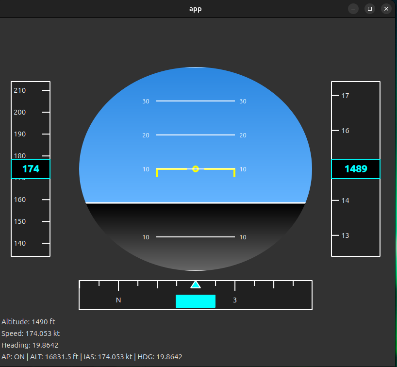

# Primary Flight Display 

A Primary Flight Display (PFD) application built with C++ and Qt, designed to visualize real-time flight data from multiple input sources.



## Overview

This project implements a glass cockpit Primary Flight Display. The architecture supports multiple flight data sources through a flexible observer-based design.

**Current Status**: Simulated flight data source with autopilot control

**Planned Sources**:
- Flight simulator integration (X-Plane, MSFS, etc.)
- ADS-B receiver input
- Real aircraft data streams

## Features

### Primary Flight Display
- Artificial Horizon with pitch and roll visualization
- Airspeed indicator with scrolling tape
- Altimeter with scrolling tape
- Heading indicator with compass tape
- Pitch ladder with degree markings
- Real-time flight data updates

### Autopilot System
- Automated altitude, speed, and heading control
- Configurable climb/descent rates
- Turn rate limiting
- Target convergence logic

### Multi-Observer Architecture
- Console output for debugging
- Qt GUI display
- Extensible for additional observers (data logging, network streaming, etc.)

## Architecture

### Design Patterns

**Observer Pattern**
- `FlightDataSubject` manages observer registration and notifications
- `IFlightDataObserver` defines the observer interface
- Implementations: `ConsoleFlightDataObserver`, `QtFlightDataObserver`
- Decouples data sources from display components

**Strategy Pattern**
- `IFlightDataSource` interface allows pluggable data sources
- Current implementation: `SimulatedSource`
- Future implementations: FlightSimSource, ADSBSource, etc.

**Interface Segregation**
- `IFlightDataSource` - flight data providers
- `IAutopilot` - autopilot control systems
- `IFlightDataObserver` - data consumers


## Building

```bash
mkdir build
cd build
cmake ..
make
./app/app
```

**Requirements**:
- C++17 compiler
- Qt 5 or Qt 6
- CMake 3.10+


## Future Development

- X-Plane/MSFS UDP data integration
- ADS-B receiver support (dump1090, RTL-SDR)
- Additional instruments (VSI, turn coordinator)
- Flight plan overlay
- Terrain awareness display
- Navigation database integration